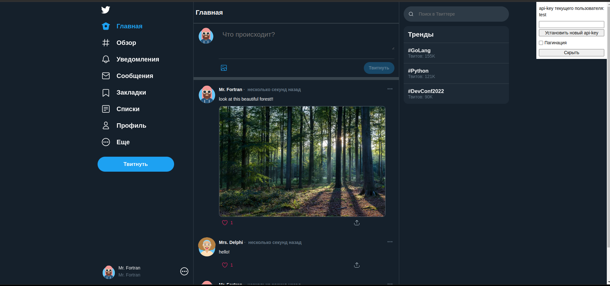

Для запуска понадобится [установленный Docker](https://docs.docker.com/engine/install/) и логин в [докер-хабе](https://hub.docker.com/)

Создайте файл `.env` и заполните по шаблону `.env.template` (для демонстрационного просмотра достаточно переименовать `.env.template` в `.env`)

Запустите команду в терминале
```shell
docker compose up
```

root - http://0.0.0.0/ (обновление страницы через переход на этот адрес, обновление страниц на дочерних url вернет ошибку 404)

swagger - http://0.0.0.0:5000/docs/

---
Тестовые юзеры:

* test
* admin

Смена пользователей происходит вводом ключа - в верхнем правом углу поле `api-key`


