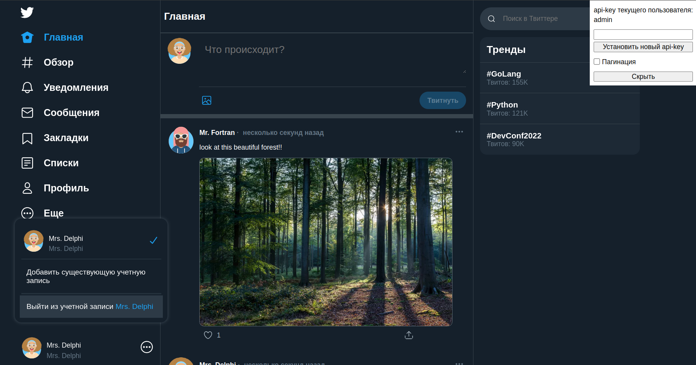

[Install Docker Engine on Ubuntu](https://docs.docker.com/engine/install/ubuntu/)

`.env.template` --> `.env`

```shell
docker compose up
```

root - http://0.0.0.0/ (обновление страницы через переход на этот адрес)

swagger - http://0.0.0.0:5000/docs/

---
Тестовые юзеры:

* test
* admin

Смена - в верхнем правом углу поле `api-key`

